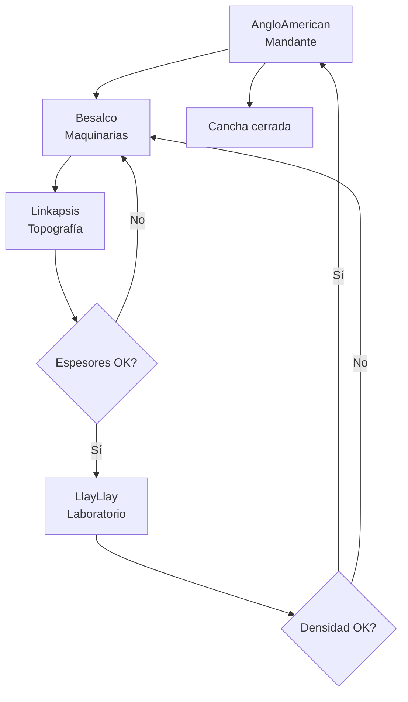

# Proyecto Canchas AngloAmerican

## Resumen

Este proyecto busca digitalizar y transparentar el flujo de trabajo de validación de canchas entre empresas colaboradoras de AngloAmerican, usando tecnologías web modernas (**Astro** como frontend y **Supabase** como backend).

---

## Diagrama general del proceso entre empresas


**Explicación:**  
1. AngloAmerican solicita la habilitación de una cancha.
2. Besalco realiza los trabajos de maquinaria.
3. Linkapsis valida los espesores y, si no cumplen, la cancha vuelve a Besalco para ser retrabajada.
4. LlayLlay toma muestras de densidad y, si no cumplen, la cancha vuelve a Besalco para retrabajo.
5. Si todo es validado, AngloAmerican firma el cierre de la cancha.

---

## Diagrama técnico del flujo de desarrollo web

```mermaid
flowchart TD
    User[Usuario\nEmpresa] --> WebPanel[Web App\nAstro]
    WebPanel --> Supabase[Supabase]
    WebPanel --> MapComponent[Componente Mapa]
    WebPanel --> Accion[Acciones\n(validar, rechazar, firmar)]
    Accion --> Supabase
    Supabase --> WebPanel
    WebPanel --> User
```
**Explicación:**  
- El usuario de cada empresa se conecta y accede a la web.
- La web (Astro) consulta y muestra datos desde Supabase (base de datos y autenticación).
- El estado y la ubicación de las canchas se visualizan en un mapa interactivo.
- Las acciones (validar, rechazar, firmar) actualizan el estado en Supabase y se reflejan en tiempo real en la interfaz.

---

## Tecnologías consideradas

- **Astro**: Framework moderno para frontend, permite crear una web rápida y visual.
- **Supabase**: Backend como servicio, provee autenticación, base de datos (PostgreSQL), y APIs automáticas.
- **Leaflet.js / MapLibre**: Para visualización interactiva de mapas y ubicación de canchas.
- **Control de acceso**: Cada empresa accede sólo a sus procesos y acciones.

---

## Objetivo

Centralizar el seguimiento y validación del proceso de trabajo de canchas, permitiendo a cada empresa interactuar y validar los hitos, con trazabilidad y visualización en tiempo real sobre el mapa.

---

Este README sirve como contexto inicial. Si el proyecto avanza, aquí se irá documentando el desarrollo, estructura y decisiones técnicas.
