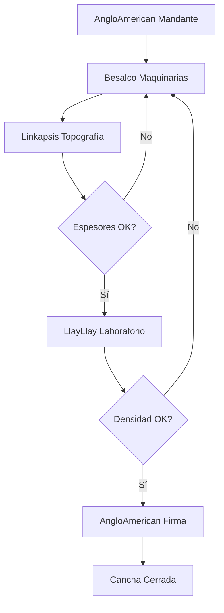
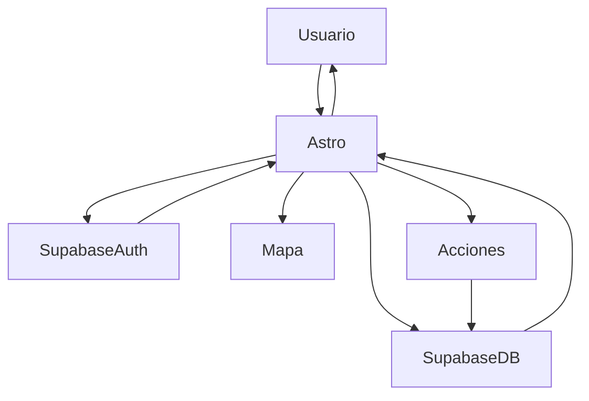

# Proyecto Canchas AngloAmerican

## Resumen

Este proyecto busca digitalizar y transparentar el flujo de trabajo de validación de canchas entre empresas colaboradoras de AngloAmerican, usando tecnologías web modernas (**Astro** como frontend y **Supabase** como backend).

---

## Diagrama general del proceso entre empresas

**Explicación:**  
1. AngloAmerican solicita la habilitación de una cancha.
2. Besalco realiza los trabajos de maquinaria.
3. Linkapsis valida los espesores y, si no cumplen, la cancha vuelve a Besalco para ser retrabajada.
4. LlayLlay toma muestras de densidad y, si no cumplen, la cancha vuelve a Besalco para retrabajo.
5. Si todo es validado, AngloAmerican firma el cierre de la cancha.

---

## Diagrama técnico del flujo de desarrollo web

**Leyenda:**
- **Usuario:** Persona de cualquier empresa que accede a la web.
- **Astro:** Aplicación web principal (frontend).
- **SupabaseAuth:** Servicio de autenticación de usuarios.
- **SupabaseDB:** Base de datos con la información de canchas, estados, historial, etc.
- **Mapa:** Componente para mostrar ubicación y estado de canchas.
- **Acciones:** Validar, rechazar, firmar, cerrar, etc.

---

## Tecnologías consideradas

- **Astro:** Framework moderno para el frontend.
- **Supabase:** Backend como servicio, autenticación y base de datos.
- **Leaflet.js / MapLibre:** Visualización de mapas.
- **Control de acceso:** Cada empresa accede solo a su información y acciones.

---

## Objetivo

Centralizar el seguimiento y validación del proceso de trabajo de canchas, permitiendo a cada empresa interactuar y validar los hitos, con trazabilidad y visualización en tiempo real sobre el mapa.
